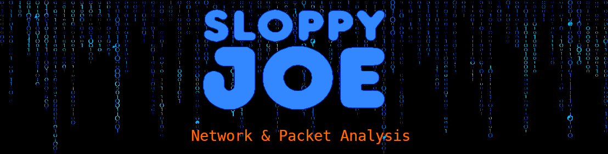

###### Sloppy



<p align="center">
  <a href="#-overview">Overview</a> •
  <a href="#-capabilities">Capabilities</a> •
  <a href="#-osi-layer-analysis">OSI Layers</a> •
  <a href="#-architecture">Architecture</a> •
  <a href="#-installation">Installation</a> •
  <a href="#-running-sloppy">Run</a> •
  <a href="https://is-leeroy-jenkins.github.io/Sloppy/">Documentation</a> •
  <a href="#-license">License</a>
</p>

___

[](https://is-leeroy-jenkins.github.io/Sloppy/)

## 📌 Overview

**Sloppy** is a Streamlit-based network traffic analysis platform for packet capture, deterministic replay, protocol normalization, interactive filtering, OSI-layer analysis, adaptive visualization, and SQLite-backed exception logging.

The application supports live traffic acquisition through Scapy and a privilege-free demo/replay path for development, testing, and demonstrations.


## ✨ Capabilities

- 🧪 **Demo / Replay Capture** — deterministic synthetic traffic without administrative privileges
- 🛰️ **Live Packet Capture** — background Scapy capture with privilege-aware startup behavior
- 🧵 **Thread-Safe Ingestion** — bounded packet and error queues with non-blocking Streamlit updates
- 🪟 **Rolling Session Window** — configurable packet retention for bounded memory use
- 🔍 **Protocol Normalization** — Ethernet, VLAN, ARP, IPv4, IPv6, TCP, UDP, ICMP, ICMPv6, TLS, HTTP, DNS, DHCP, and NTP metadata
- 🎛️ **Interactive Filtering** — protocol, endpoint, port, frame, network, transport, session, TLS, DNS, application, and time-window filters
- 🧭 **Seven Analysis Modes** — Network, Data Link, Network Layer, Transport, Session, Presentation, and Application
- 📊 **Adaptive Visualization** — informational state for zero categories, read-only table for one category, and Plotly chart for two or more categories
- 📋 **Interactive Data Views** — sortable metrics, charts, matrices, timelines, relationships, and packet metadata tables
- 🧾 **Structured Exception Logging** — sanitized errors persisted through `boogr.py` to `logging/Exceptions.db`
- 📚 **MkDocs Documentation** — Material-based documentation with search, API references, architecture diagrams, workflows, and OSI coverage

## 🧭 OSI-Layer Analysis

| OSI layer | Sloppy mode | Primary analysis |
|---|---|---|
| Layer 7 — Application | Application Analysis | DNS, HTTP, DHCP, NTP, methods, status codes, message types, and application activity |
| Layer 6 — Presentation | Presentation Analysis | TLS versions, handshake metadata, SNI, ALPN, cipher suites, and certificate metadata when available |
| Layer 5 — Session | Session Analysis | Bidirectional conversations, directional packet and byte counts, duration, lifecycle, and activity state |
| Layer 4 — Transport | Transport Analysis | TCP, UDP, ICMP, ports, flags, windows, retransmission indicators, and transport distributions |
| Layer 3 — Network | Network Layer Analysis | IPv4, IPv6, TTL, hop limit, fragmentation, DSCP, ECN, ICMP, address scope, and subnets |
| Layer 2 — Data Link | Data Link Analysis | Ethernet, MAC addresses, ARP, VLAN, EtherType, broadcast, multicast, and frame classification |
| Layer 1 — Physical | Indirect support | Packet size and capture timing only; no signal, radio, or physical-link telemetry |

## 🧱 Architecture

```text
┌──────────────────────────────┐
│ Capture Sources              │
│ Demo / Replay • Live Scapy   │
└──────────────┬───────────────┘
               │ raw packets
┌──────────────▼───────────────┐
│ Capture & Ingestion          │
│ Thread • Packet Queue        │
│ Error Queue • Drain Pipeline │
└──────────────┬───────────────┘
               │ normalized records
┌──────────────▼───────────────┐
│ Protocol Parsing             │
│ L2 • L3 • L4 • L5 • L6 • L7 │
└──────────────┬───────────────┘
               │ session state
┌──────────────▼───────────────┐
│ Analytics & Visualization    │
│ Metrics • Charts • Tables    │
│ Adaptive Sparse Rendering    │
└──────────────┬───────────────┘
               │
┌──────────────▼───────────────┐
│ Streamlit Dashboard          │
└──────────────────────────────┘

Exceptions from capture, parsing, state, and rendering flow through
boogr.py into logging/Exceptions.db.
```

Detailed diagrams are available in the [MkDocs documentation](https://is-leeroy-jenkins.github.io/Sloppy/).

## 📁 Project Structure

```text
Sloppy/
├── app.py                         # Streamlit UI, capture orchestration, analysis, and rendering
├── boogr.py                       # Structured exception wrapping and SQLite logging
├── config.py                      # UI, protocol, chart, filtering, and logging configuration
├── requirements.txt               # Runtime dependencies
├── mkdocs.yml                     # MkDocs Material configuration
├── docs/                          # Technical and API documentation
│   ├── api/
│   ├── images/
│   ├── stylesheets/
│   └── user-guide/
├── logging/
│   └── Exceptions.db              # Local exception database
├── resources/
│   └── images/
└── README.md
```

## 🖥️ Application Modes

### 🧪 Demo / Replay

- Generates deterministic traffic for development and demonstrations
- Requires no elevated privileges
- Exercises ingestion, normalization, filtering, analysis, visualization, and logging

### 🛰️ Live Capture

- Captures traffic through Scapy
- Runs in a background daemon thread
- Uses bounded queues to isolate capture from Streamlit reruns
- Reports capture failures through the sidebar and structured exception log
- Requires administrator or root privileges on most systems

## 🎛️ User Interface

### Sidebar

- Capture mode selection
- Start and stop controls
- Analysis mode selection
- Mode-specific filters
- Packet-window configuration
- Capture status and error reporting

### Main Workspace

- Mode-specific title and OSI scope
- Executive metrics
- Ranked categorical analysis
- Timelines and distributions
- Relationship matrices and flow views
- Read-only sparse-category editors
- Filtered packet metadata tables

## 📊 Adaptive Visualization

Categorical visualizations use a shared rendering policy:

| Distinct categories | Rendered output |
|---:|---|
| 0 | Informational empty state |
| 1 | Read-only `st.data_editor` summary |
| 2 or more | Plotly visualization |

Horizontal ranked charts use a linear count axis and categorical labels. Plot titles are rendered once through Streamlit section headings to prevent duplicate or undefined titles.

## 🧾 Logging

Application exceptions use the established structured pattern:

```python
except Error:
    raise
except Exception as e:
    exception = Error( e )
    exception.module = 'app'
    exception.cause = '<component>'
    exception.method = '<method signature>'
    Logger( ).write( exception )
    raise exception
```

`boogr.py` sanitizes diagnostic content, initializes the SQLite schema, writes structured records, and purges expired logs according to the configured retention period.

## 📦 Installation

### Windows PowerShell

```powershell
python -m venv .venv
.\.venv\Scripts\Activate.ps1
python -m pip install --upgrade pip
pip install -r requirements.txt
```

### Linux or macOS

```bash
python -m venv .venv
source .venv/bin/activate
python -m pip install --upgrade pip
pip install -r requirements.txt
```

## ▶️ Running Sloppy

```powershell
streamlit run app.py
```

Live capture generally requires an elevated terminal. Demo / Replay mode does not require elevation.

## 📚 Documentation

Build the documentation:

```powershell
Remove-Item -Recurse -Force .\site -ErrorAction SilentlyContinue
mkdocs build --strict
```

Run the local documentation server:

```powershell
mkdocs serve
```

Documentation URL:

- [Sloppy Network Analyzer Documentation](https://is-leeroy-jenkins.github.io/Sloppy/)
- [Source Repository](https://github.com/is-leeroy-jenkins/Sloppy)

## 🧪 Validation

```powershell
python -m py_compile app.py boogr.py config.py
mkdocs build --strict
```

Validation targets:

- Python compilation succeeds
- MkDocs strict build completes without warnings
- Search returns results across documentation pages
- Architecture, workflow, and OSI diagrams render
- API reference pages collect documented Python members
- Repository, edit, and view links resolve to the `main` branch

## 🧭 Extension Points

- PCAP import and export
- Five-tuple flow reconstruction
- Anomaly and threat scoring
- Persistent analysis sessions
- Protocol-specific reports
- CSV and Markdown exports
- Queue-based distributed capture
- Historical traffic comparison

## 📜 License
Sloppy Joe is published under the [MIT General Public License v3](https://github.com/is-leeroy-jenkins/Sloppy/blob/main/LICENSE.txt)


© 2022–2026 Terry D. Eppler
