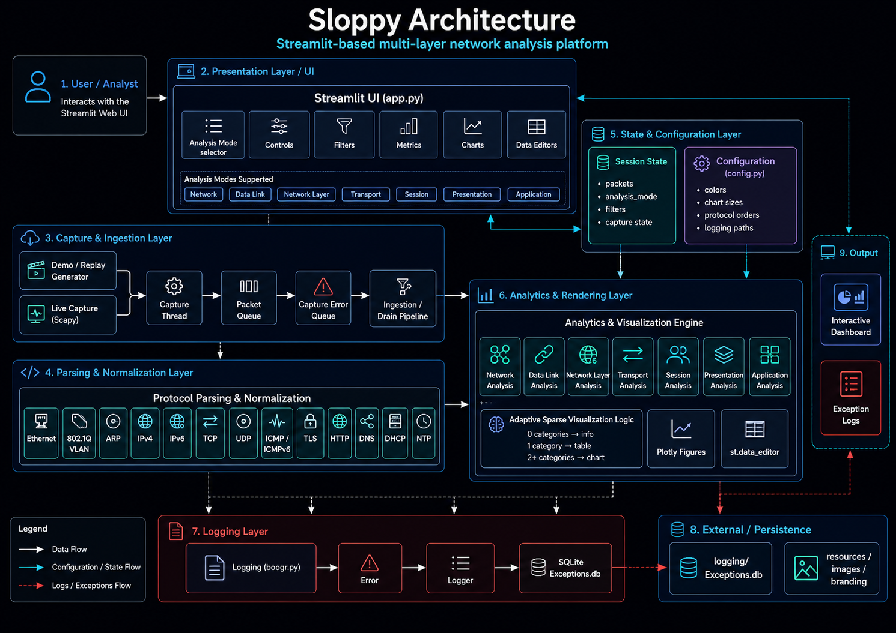

# Architecture

## :material-view-dashboard-outline: Presentation Layer

`app.py` defines the Streamlit interface, sidebar controls, analysis-mode dispatch, metric cards, Plotly output, and read-only data editors.

Primary UI responsibilities:

- Initialize and maintain `st.session_state` values.
- Expose capture and filtering controls.
- Dispatch the selected analysis mode.
- Render metrics, charts, tables, warnings, and capture errors.
- Preserve stable component keys across reruns.

## :material-download-network-outline: Capture and Ingestion

Two packet-acquisition paths feed a queue-based ingestion pipeline.

| Path | Components | Behavior |
|---|---|---|
| Demo / replay | Scenario generator → packet queue | Produces normalized representative traffic without requiring capture privileges |
| Live capture | Scapy sniffer → callback → packet queue | Captures packets on a background thread and forwards normalized records to Streamlit |

Supporting components:

- Capture thread lifecycle controls.
- Packet queue for captured records.
- Capture-error queue for background failures.
- Queue draining during Streamlit reruns.
- Sliding packet-window enforcement.

## :material-code-json: Parsing and Normalization

Packet records are normalized into consistent dictionaries before analysis. Normalized fields support protocol-independent filtering and mode-specific summaries.

Protocol coverage includes:

- Ethernet and MAC addressing.
- 802.1Q VLAN metadata.
- ARP operation and address relationships.
- IPv4 and IPv6 metadata.
- TCP, UDP, ICMP, and ICMPv6 transport details.
- TLS handshake metadata.
- HTTP request and response metadata.
- DNS query and response metadata.
- DHCP message types.
- NTP packet metadata.

## :material-database-cog-outline: State and Configuration

`st.session_state` stores operational state, packet records, capture state, filters, and selected analysis mode. `config.py` stores fixed labels, color palettes, protocol orders, visualization limits, paths, and environment-backed settings.

State flow:

1. Capture or replay produces packet records.
2. Queue draining normalizes and appends records.
3. Filters produce a mode-specific snapshot.
4. Analysis functions aggregate the snapshot.
5. Renderers display metrics and visualizations.

## :material-chart-box-outline: Analytics and Rendering

Analytics functions separate data preparation from presentation where practical.

| Function class | Responsibility |
|---|---|
| Snapshot builders | Filter and shape packet records for a specific analysis scope |
| Aggregators | Produce counts, distributions, conversations, matrices, and timelines |
| Figure builders | Construct Plotly figures without Streamlit control flow |
| Renderers | Select metrics, charts, data editors, warnings, and layout containers |

Adaptive categorical rendering rules:

| Distinct categories | Output |
|---:|---|
| 0 | Informational empty state |
| 1 | Read-only `st.data_editor` summary |
| 2 or more | Plotly visualization |

Numeric renderers use tables instead of histograms when the available values cannot form a meaningful distribution.

## :material-alert-circle-outline: Logging and Failure Flow

`boogr.py` provides the application logging contract:

1. Catch the original exception.
2. Wrap the exception in `Error`.
3. Set `module`, `cause`, and `method` metadata.
4. Write the record through `Logger().write(...)`.
5. Raise the wrapped exception on the Streamlit thread or place a sanitized capture error in the sidebar queue.

Structured records persist to `logging/Exceptions.db`.
