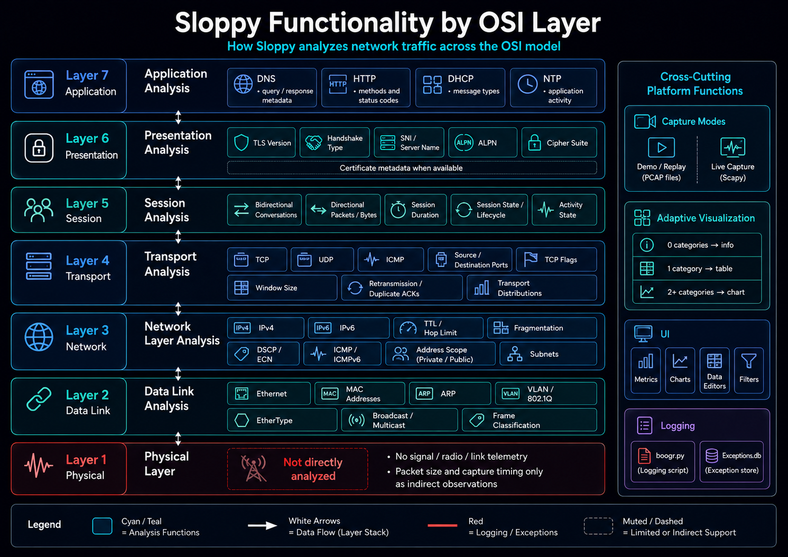

# OSI Coverage

## :material-numeric-7-box: Layer 7 — Application

**Mode:** Application Analysis

| Protocol | Extracted or analyzed metadata |
|---|---|
| DNS | Query type, query name, response code, query/response classification |
| HTTP | Method, host, path, response status, content metadata when available |
| DHCP | Message type and application activity |
| NTP | Version, mode, stratum, leap indicator, and packet activity |

## :material-numeric-6-box: Layer 6 — Presentation

**Mode:** Presentation Analysis

- TLS version.
- Handshake type.
- Server Name Indication.
- Application-Layer Protocol Negotiation value.
- Cipher suite.
- Certificate metadata when present in captured payloads.

## :material-numeric-5-box: Layer 5 — Session

**Mode:** Session Analysis

- Bidirectional conversation identifiers.
- Directional packet and byte counts.
- Session duration.
- Conversation lifecycle and activity state.
- Endpoint and protocol relationships.

## :material-numeric-4-box: Layer 4 — Transport

**Mode:** Transport Analysis

- TCP, UDP, ICMP, and ICMPv6 distributions.
- Source and destination ports.
- TCP flags.
- TCP window sizes.
- Retransmission and duplicate acknowledgment indicators.
- Transport-level packet and byte distributions.

## :material-numeric-3-box: Layer 3 — Network

**Mode:** Network Layer Analysis

- IPv4 and IPv6 distributions.
- Source and destination address scope.
- TTL and hop-limit distributions.
- Fragmentation indicators.
- DSCP and ECN values.
- ICMP and ICMPv6 types.
- Subnet relationships.

## :material-numeric-2-box: Layer 2 — Data Link

**Mode:** Data Link Analysis

- Ethernet frame metadata.
- Source and destination MAC addresses.
- EtherType classification.
- ARP operation and address mappings.
- VLAN / 802.1Q metadata.
- Unicast, multicast, and broadcast classification.
- MAC-to-IP relationships.

## :material-numeric-1-box: Layer 1 — Physical

Direct signal, radio, cable, link-quality, and interface-telemetry analysis is not implemented. Packet size and capture timing provide indirect observations only.
