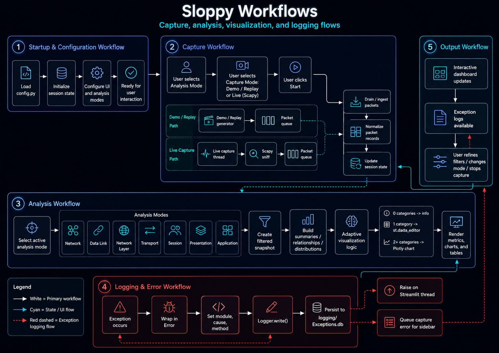

# Workflows

## :material-power: Startup and Configuration

1. Import `config.py` values.
2. Configure the Streamlit page.
3. Initialize required `st.session_state` keys.
4. Initialize capture queues, capture state, and packet storage.
5. Render the selected analysis mode and its controls.

## :material-access-point: Packet Capture

### Demo / Replay

1. Generate a representative protocol scenario.
2. Normalize each generated record.
3. Place records in the packet queue.
4. Drain the queue into session-state packet storage.
5. Enforce the configured packet-window size.

### Live Scapy Capture

1. Validate capture availability and selected interface.
2. Start a background capture thread.
3. Invoke the packet callback for each captured packet.
4. Parse and normalize supported protocol metadata.
5. Place normalized records in the packet queue.
6. Drain the queue during Streamlit reruns.
7. Stop capture when requested or when the capture thread exits.

## :material-filter-variant: Filtering

1. Build a complete DataFrame from session-state packet records.
2. Apply global protocol, port, address, and time-window filters.
3. Apply mode-specific filters.
4. Produce a filtered snapshot without mutating the underlying packet history.
5. Pass the snapshot to aggregation and rendering functions.

## :material-chart-areaspline: Analysis and Visualization

1. Select the active analysis mode.
2. Build mode-specific summaries and relationships.
3. Apply sparse-data rules.
4. Create Plotly figures or read-only data editors.
5. Render metrics, visualizations, and packet-level details.

## :material-alert-outline: Error Handling

### Streamlit Thread

1. Catch the exception.
2. Preserve existing `Error` instances without duplicate logging.
3. Wrap other exceptions in `Error`.
4. Set module, cause, and method metadata.
5. Write the exception through `Logger`.
6. Raise the wrapped exception.

### Capture Thread

1. Catch the exception in the background thread.
2. Wrap and log the exception.
3. Place a sanitized capture error in the capture-error queue.
4. Stop the capture event when continued capture is unsafe.
5. Display the queued error in the Streamlit sidebar.
